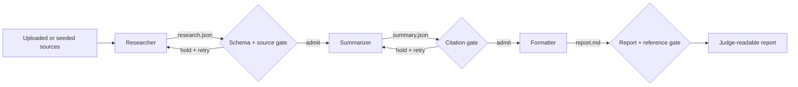

# Handoff Gate — TechJam 2026

Handoff Gate is our Track 1 multi-agent coordination project. It runs a staged
**Researcher → Summarizer → Formatter** pipeline in which every handoff is
schema-validated before the next agent can see it. An uncited claim is held at
the gate and cannot reach the final report.

The web demo can run in deterministic mock mode with no cloud credentials, or
with real Codex agents backed by the Volcengine Ark Responses API.

## Fastest organizer setup (no API key or Docker)

This path exercises the real UI, API, session store, validation gates, event
stream, retries, and artifact chain. Only the agent responses are deterministic.

### Requirements

- Node.js 22 or newer
- npm 10 or newer

### 1. Install and start

```bash
git clone https://github.com/changfazhi/techjam-26-.git
cd techjam-26-
npm ci

ARK_API_KEY=test-key \
ARK_MODEL=ep-test \
RUNTIME_PROVIDER=mock \
npm run dev
```

The mock runner does not contact Ark, but the application still requires the
two non-placeholder test values shown above when dispatching an agent.

Keep that terminal open, then visit:

- Web UI: <http://localhost:5173>
- API health check: <http://localhost:3000/api/health>

### 2. Run the live UI demo

On a fresh install:

1. Select **Create Agent**.
2. Name the agent `Researcher`; the description and instructions can be brief.
3. Select the new Researcher from the sidebar.
4. Select **Pipeline** in the page header.
5. Select **Start live demo**.
6. Watch Researcher, Summarizer, and Formatter reach **3 / 3 admitted**.
7. In the artifact chain, select **Open large report view** to present the final
   Markdown report.

The built-in demo asks what can be recovered from lithium-ion batteries and
shows how every finding retains its source document.

### Optional: seed the demo from the terminal

With `npm run dev` still running, open a second terminal in the repository:

```bash
npm run demo
```

This creates all three agents, runs the battery-recycling session, and prints
events until the session finishes. Refresh the browser, select **Researcher →
Pipeline**, and choose the completed session from the **Session** menu.

### Optional: visibly demonstrate a rejected citation

Start the app with one deliberate bad citation:

```bash
ARK_API_KEY=test-key \
ARK_MODEL=ep-test \
RUNTIME_PROVIDER=mock \
MOCK_MISBEHAVIOUR=WRONG_CITATION \
npm run dev
```

The Summarizer's first artifact is rejected, its violation appears in the event
log, and the corrected retry is admitted. The invalid artifact never propagates
to the Formatter.

## Research uploaded documents

The same panel can research organizer-provided material:

1. Enter a question under **Research your documents**.
2. Select up to 10 source files.
3. Select **Research uploaded documents**.
4. Follow the live stages and open the completed report.

Supported files:

- PDF (up to 10 MB)
- TXT, Markdown, CSV, JSON, XML, HTML, YAML, and LOG (up to 100 KB each)
- Extracted text is limited to 100,000 characters per source

PDF text is extracted locally in the browser before it enters the pipeline.
Scanned or image-only PDFs need OCR first; the UI reports this instead of
silently sending an empty source.

## Run with real AI agents

Use this path to demonstrate actual Codex agent turns through Volcengine Ark.

Additional requirements:

- A Volcengine Ark API key
- A Responses-compatible Ark endpoint/model ID, normally `ep-...`
- One running container engine: Docker, Colima, or Podman

From the repository root:

```bash
ARK_API_KEY=your-ark-api-key \
ARK_MODEL=ep-your-endpoint-id \
npm run poc
```

The first run installs dependencies when needed, builds the dedicated Runtime
image, selects an available container engine, builds the web application, and
starts it at <http://localhost:3000>.

Use the same UI steps described above. Real runs take longer than mock runs
because each stage launches a Codex turn and may retry a held artifact.

To force Podman when more than one engine is installed:

```bash
CONTAINER_ENGINE=podman \
ARK_API_KEY=your-ark-api-key \
ARK_MODEL=ep-your-endpoint-id \
npm run poc
```

Press `Ctrl+C` to stop. Agent workspaces and conversations remain available:

- macOS: `~/.volc-agent-launchpad/`
- Linux: `.local/`
- Custom path: set `LOCAL_POC_DATA_ROOT`

## What the demo proves



- Agent workspaces are isolated from one another.
- The coordinator brokers every cross-agent artifact.
- Each artifact must satisfy its stage schema.
- Summary citations must point to admitted Researcher claims.
- The final report must carry the source documents for every cited claim.
- Held artifacts leave an auditable event and never enter downstream context.

## Useful commands

| Command | Purpose |
| --- | --- |
| `npm run dev` | Start the development API and web UI. |
| `npm run poc` | Build and run the real local container-backed POC. |
| `npm run demo` | Drive the battery pipeline through the running API. |
| `npm run check` | Run typechecks, tests, and production builds. |
| `npm run test` | Run the server and middleware tests. |

## Configuration

| Variable | Typical value | Purpose |
| --- | --- | --- |
| `ARK_API_KEY` | `test-key` or a real key | Required dispatch credential. Mock mode makes no Ark call. |
| `ARK_MODEL` | `ep-test` or an Ark endpoint ID | Responses-compatible model/endpoint identifier. |
| `RUNTIME_PROVIDER` | `mock`, `container`, `local-process` | Select deterministic, container, or host Codex execution. |
| `MOCK_MISBEHAVIOUR` | `NONE`, `WRONG_CITATION` | Select the normal mock or visible citation-retry scenario. |
| `APP_AUTH_TOKEN` | 24+ URL-safe characters | Required when production listens beyond loopback. |
| `LOCAL_POC_DATA_ROOT` | A host directory | Override persistent local POC storage. |

See [.env.example](.env.example) for all paths, limits, and runtime options.

## Troubleshooting

**The UI says “Runtime configuration needed.”**

Restart with non-placeholder `ARK_API_KEY` and `ARK_MODEL` values. Use
`test-key` and `ep-test` in mock mode.

**The panel says “Demo fixture — not live data.”**

Select **Start live demo**, or choose a persisted run from the Session menu.

**Port 3000 or 5173 is already in use.**

Stop the earlier development process before starting another copy.

**The PDF reports that no readable text was found.**

It is probably scanned or image-only. Run OCR on the PDF, then upload the
searchable copy.

**No container engine was found.**

Start Docker Desktop, Colima, or the Podman machine, then rerun `npm run poc`.
For a no-container evaluation, use the mock setup at the top of this README.

## Project documentation

- [Project blueprint](docs/BLUEPRINT.md)
- [Architecture](docs/ARCHITECTURE.md)
- [Implementation plan](docs/PLAN.md)
- [Detailed local POC setup](docs/LOCAL_POC.md)
- [Deployment guide](docs/DEPLOYMENT.md)
- [Security policy](SECURITY.md)

This is a single-user hackathon proof of concept. Use scoped demonstration
credentials and non-sensitive source documents. It is licensed under the
[MIT License](LICENSE).
