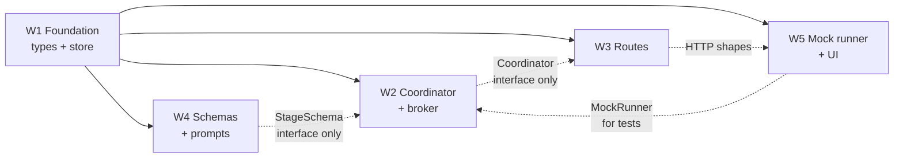

# Handoff Gate — Five Workstreams

How five people build this in three days without spending day three resolving merge
conflicts.

**The core idea:** conflicts happen in *shared files*. So we make almost every file owned by
exactly one person, and we land every edit to a shared file in **one commit on day 1**, before
anyone branches. After that commit, the shared files are frozen.

Read [`BLUEPRINT.md`](./BLUEPRINT.md) first — it defines every type and interface referenced
here.

---

## 1. Who owns what

| # | Workstream | Owner | Owns these paths **exclusively** |
|---|---|---|---|
| **W1** | Foundation & data | | `apps/server/src/session/types.ts`, `apps/server/src/session/session-store.ts`, plus **all shared-file edits** |
| **W2** | Coordinator & broker | | `apps/server/src/session/coordinator.ts`, `broker.ts`, `coordinator.test.ts` |
| **W3** | API & routes | | `apps/server/src/session/routes.ts`, `routes.test.ts` |
| **W4** | Schemas & prompts | | `apps/server/src/session/schemas/**`, `session/prompt.ts`, `schemas.test.ts` |
| **W5** | Runtime & UI | | `apps/server/src/mock-runner.ts`, `apps/web/src/pipeline/**` |

**Rule:** if you need a change in a file you do not own, ask the owner. Do not edit it, not
even a one-line import. This single rule prevents roughly all of the conflicts.

### Difficulty and dependency

- **W4 is the most self-contained** — pure functions, no agents, no async. Give it to whoever
  is least comfortable with the codebase. It is also the most *important* single piece (the
  citation gate), so it is not busywork.
- **W2 is the hardest** — async, timing, cancellation. Give it to whoever is strongest.
- **W1 is small but blocking** — it must finish first, so it needs someone who will be at the
  keyboard early on day 1. Afterwards W1 becomes the integrator (§6).

---

## 2. The foundation commit

**W1 lands this alone, on day 1, before anyone else branches.** It is the only commit that
touches pre-existing files. Target: done within the first two hours.

It contains:

1. `apps/server/src/session/types.ts` — every type from BLUEPRINT §4, complete.
2. `apps/server/src/types.ts` — `Database` gains `sessions` and `sessionEvents`.
3. `apps/server/src/store.ts` — `emptyDatabase()` gains the two arrays; `initialize()` spreads
   defaults (`this.data = { ...emptyDatabase(), ...parsed }`).
3b. `apps/server/src/config.ts` — `"mock"` added to the `RUNTIME_PROVIDER` enum.
4. `apps/server/src/runner-factory.ts` — the `mock` branch.
5. `apps/server/src/index.ts` — constructs the four new objects and passes them to `createApp`.
6. `apps/server/src/app.ts` — one `await app.register(sessionRoutes, { ... })`.
7. `apps/web/src/api.ts` — a `pipelineApi` export appended at the end, fully populated with
   all five routes so W5 never reopens this file.
8. `apps/web/src/types.ts` — session type mirrors appended at the end.
9. `apps/web/src/App.tsx` — one `useState`, one button, one conditional mount of `PipelinePanel`.
10. **Stubs for every module W2–W5 will write** — see below.

### The stub-first rule

The foundation commit includes an empty but *type-correct* file for every module, so the whole
project compiles from hour one and `npm run check` never goes red on `main`.

```ts
// apps/server/src/session/coordinator.ts  — stub landed by W1, implemented by W2
export class SessionCoordinator {
  constructor(private readonly deps: CoordinatorDeps) {}
  async start(_sessionId: string): Promise<Session> { throw new Error("not implemented"); }
  async stop(_sessionId: string): Promise<Session> { throw new Error("not implemented"); }
  isRunning(_sessionId: string): boolean { return false; }
}
```

Same shape for `broker.ts`, `routes.ts`, `schemas/index.ts`, `prompt.ts`, `mock-runner.ts`, and
`PipelinePanel.tsx`. Every signature matches BLUEPRINT §5 exactly.

**Consequence:** from hour two, all five people work in parallel against real, compiling
interfaces. Nobody waits for anybody.

---

## 3. Interface freeze

The signatures in BLUEPRINT §5 are frozen once the foundation commit lands. If you need to
change one:

1. Say so in the team chat **before** you write the code.
2. W1 makes the change in the shared file and pushes to `main`.
3. Everyone rebases.

An unannounced signature change is the one thing that will genuinely cost the team an hour.

---

## 4. Shared-file contracts

These four rules cover every file more than one person might otherwise touch.

**`apps/server/src/types.ts` — frozen after the foundation commit.**
All new session types go in `session/types.ts`, which W1 owns. There is never a second reason
to open the root `types.ts`.

**`apps/server/src/app.ts` — exactly one added line, ever.**
```ts
await app.register(sessionRoutes, { service, coordinator, sessions });
```
Every route lives in `session/routes.ts` as a Fastify plugin. W3 never opens `app.ts`.

**`apps/web/src/api.ts` — append-only, separate export.**
```ts
// existing `api` object above — DO NOT EDIT
export const pipelineApi = {
  create: (body: CreateSessionInput) => request<{ session: Session }>("/api/sessions", { ... }),
  // ...
};
```
Adding to a new object at the end of the file cannot conflict with anything.

**`apps/web/src/App.tsx` — three lines, in the foundation commit.**
```tsx
const [showPipeline, setShowPipeline] = useState(false);          // with the other useState calls
<button className="button button-ghost" onClick={() => setShowPipeline(true)}>Pipeline</button>
{showPipeline && selected && (
  <PipelinePanel agentId={selected.id} onClose={() => setShowPipeline(false)} />
)}
```
W5 then works entirely inside `apps/web/src/pipeline/`.

**`package.json` / `package-lock.json` — frozen.** No new dependencies (BLUEPRINT §1.4). If you
believe you need one, raise it with W1 first; the answer is almost certainly `zod`, already
installed.

---

## 5. Dependency graph



Solid arrows are hard blocks (resolved by the foundation commit). Dotted arrows are *interface*
dependencies — resolved by the stubs, so no one is ever actually blocked after hour two.

**The only real ordering constraint:** W1's foundation commit, then everything else at once.

---

## 6. Branching and merging

```bash
# after the foundation commit is on main
git switch -c feat/coordinator     # W2
git switch -c feat/routes          # W3
git switch -c feat/schemas         # W4
git switch -c feat/runtime-ui      # W5
```

- **Merge into `main` at least twice a day**, morning and evening. A branch that lives three
  days is a conflict waiting to happen, even with clean ownership.
- **Rebase, do not merge**, when picking up other people's work:
  `git fetch origin && git rebase origin/main`. Keeps history readable, which matters because
  judges will look at the commit log.
- **W1 owns `main`** and reviews every PR. One person holding the integration view catches
  contract drift before it compounds.
- **`main` must always pass `npm run check`.** If it goes red, that is the whole team's problem
  until it is green.

---

## 7. Day by day

| | Day 1 | Day 2 | Day 3 |
|---|---|---|---|
| **W1** | Foundation commit (§2). Then `SessionStore` + its tests. | Review PRs. Seed logic in the broker with W2. Keep `main` green. | README, architecture diagram export, `npm run check`, demo dry-run ops. |
| **W2** | Read the code. Write `runStage` against stubs. | Full stage loop, retry budget, timeout + cancel, broker deliver. Coordinator tests. | Real-runner run-through. Fix what the real Codex output breaks. |
| **W3** | Route shapes + zod param validation against the coordinator stub. | All five routes wired to the real coordinator. Route tests incl. double-start 409. | Error handling polish. `curl` script for the demo. |
| **W4** | All three schemas + redaction, fully tested. **No agents needed.** | `prompt.ts` assembly: instruction + `describe()` + digest + violations. | Tune prompts against real Codex output — this is where day 3 goes. |
| **W5** | `MockRunner` first (unblocks W2's tests), then panel skeleton. | Stage timeline, artifact viewer, event polling via `?after=seq`. | Held-stage violations display, Stop button, the 3/3-admitted invariant line. |

**W4's day 1 is the highest-value hour of the project.** The citation gate, tested standalone,
is the submission's core claim — and it needs no containers, no Ark key, and no coordinator.

---

## 8. Definition of done

A workstream is done when it satisfies its own criterion **and** `npm run check` passes.

- **W1** — a session survives a server restart; `main` is green; every interface in
  BLUEPRINT §5 exists and compiles.
- **W2** — `coordinator.test.ts` covers all five cases in PLAN §5, including the hallucinated
  citation leaving `version` unchanged.
- **W3** — every route in BLUEPRINT §5.5 returns the documented status codes; concurrent
  `start` yields exactly one `session.started` event.
- **W4** — a summary citing a nonexistent claim id is rejected with a violation string a model
  can act on; a credential in an artifact is rejected.
- **W5** — `RUNTIME_PROVIDER=mock` drives a full three-stage pipeline in under two seconds;
  the panel shows the timeline, the artifacts, and a held stage's violations.

---

## 9. If you are blocked

1. **Do not wait.** Every interface has a stub. Write against it.
2. **Do not edit someone else's file** to unblock yourself. Message the owner; it is faster
   than the rebase you would otherwise cause.
3. **Do not add a dependency** to work around a gap. Ask W1.
4. If the real Codex path is slow or flaky, switch to `RUNTIME_PROVIDER=mock` and keep moving.
   Only W2 and W5 need the real runner before day 3.
